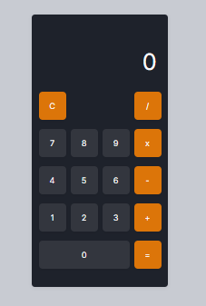

# 🧮 Calculadora Aritmética com React

Aplicação web desenvolvida com **React** utilizando **Vite e Styled-Components**, capaz de realizar operações matemáticas básicas por meio de uma interface moderna, intuitiva e responsiva. O projeto foi proposto como desafio prático do **Módulo I: Fundamentos do React do curso de Formação React Developer** da [DIO.me](https://www.dio.me/).

### Status do Projeto: ✅ Concluído

<br>

## 📋 Sobre o Projeto

A **Calculadora Aritmética com React** é uma aplicação simples que permite realizar operações matemáticas básicas através de uma interface semelhante às calculadoras digitais tradicionais.

O projeto foi criado para aplicar os conceitos fundamentais do ecossistema React durante o processo de aprendizagem, explorando componentização, gerenciamento de estado e manipulação de eventos:

* Componentização
* Hooks (`useState`)
* Manipulação de eventos
* Renderização reativa
* Gerenciamento de estado
* Styled-Components
* Organização de projetos React

### Objetivo

Aplicar os principais conceitos introdutórios do React por meio da construção de uma aplicação funcional e interativa.

### Problema Resolvido

O projeto demonstra como criar interfaces reativas utilizando React, permitindo atualizar dados em tempo real conforme as interações do usuário, sem necessidade de recarregar a página.

<br>

## ✨ Funcionalidades

### Funcionalidades Implementadas

* [x] Soma
* [x] Subtração
* [x] Multiplicação
* [x] Divisão
* [x] Atualização do display em tempo real
* [x] Inserção dinâmica de números
* [x] Limpeza do visor
* [x] Tratamento de operações sequenciais
* [x] Interface responsiva
* [x] Componentização utilizando React
* [x] Estilização com Styled-Components

<br>

## 🛠️ Tecnologias Utilizadas

### Front-end


### Ferramentas


<br>

## 🏗️ Arquitetura do Projeto

O projeto segue uma arquitetura baseada em componentes, padrão amplamente utilizado em aplicações React.

Características principais:

* Componentização da interface
* Gerenciamento de estado com Hooks
* Atualização reativa da interface
* Separação entre lógica e apresentação
* Estilização modular com Styled-Components

<br>

## 📂 Estrutura de Diretórios

```text
react-calculator/
│
├── calculator
│   └── src
│   │   ├── components/       # Componentes reutilizáveis
│   │   ├── global/           # Estilos globais
│   │   ├── App.jsx           # Componente principal
│   │   ├── main.jsx          # Ponto de entrada da aplicação
│   │   └── styles.js         # Estilização dos componentes
│   │
│   ├── package.json          # Dependências e scripts
│   ├── vite.config.js        # Configuração do Vite
│   └── .gitignore            # Evitar versionamento de informações específicas do projeto
│
├── docs                      # Documentação do projeto
│   └── pages                 # Imagens das páginas
│
└── README.md    
```

<br>

## ⚙️ Pré-requisitos

Antes de iniciar, você precisará ter instalado:

* Navegador Web (Google Chrome, Brave ou Microsoft Edge)
* [Git (recomendado)](https://git-scm.com/install//windows)
* [Visual Studio Code (recomendado)](https://code.visualstudio.com/)
* [Node.js (versão 18 ou superior) + NPM](https://nodejs.org/pt-br) 

<br>

## 🚀 Como Executar

### 1. Clonar o Repositório

```bash
git clone https://github.com/DevJoaoVitorB/react-calculator.git
```

### 2. Entrar na Pasta

```bash
cd calculator
```

### 3. Instalar Dependências

```bash
npm install
```

### 4. Executar o Projeto

```bash
npm run dev
```

### 5. Acessar a Aplicação

Após iniciar o servidor, acesse a URL exibida no terminal:

```text
http://localhost:5173
```

<br>

## 📸 Screenshots

### Interface da Calculadora



<br>

## 👨‍💻 Autor

| **DevJoaoVitorB** |
| ----------------- |
|  |
| [](https://github.com/DevJoaoVitorB) [](https://www.linkedin.com/in/devjoaovitorb) |
